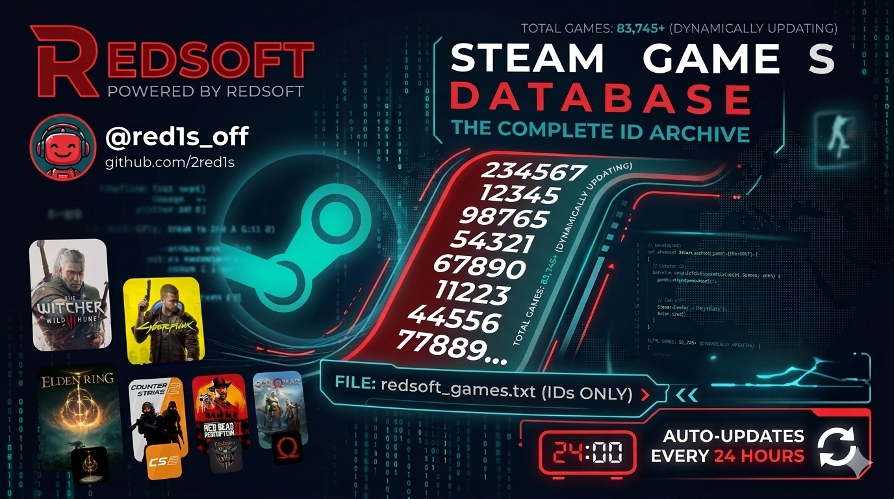

# GamesData
> Automated Steam AppID provider by RedSoft

---

### 🇷🇺 Russian
Актуальная база ID всех игр Steam в одном файле.
- **Source:** `redsoft_games.txt`
- **Sync:** 24h interval ⏱️
- **Parsing:** Comma-separated (CSV style)

### 🇺🇸 English
Up-to-date database of all Steam game IDs.
- **Source:** `redsoft_games.txt`
- **Sync:** 24h interval ⏱️
- **Parsing:** Comma-separated (CSV style)

### 🇰🇿 Kazakh
Steam ойындарының ID базасы.
- **Source:** `redsoft_games.txt`
- **Sync:** 24 сағат сайын ⏱️
- **Parsing:** Үтір арқылы (CSV стилі)

### 🇨🇳 Chinese
Steam 游戏 ID 数据库。
- **文件:** `redsoft_games.txt`
- **更新:** 每 24 小时 ⏱️
- **格式:** 逗号分隔 (CSV 格式)

---

## 🛠 Developer Access (RAW)

Для интеграции в ваш софт используйте прямой метод запроса:

```bash
# Example cURL request
curl https://raw.githubusercontent.com
